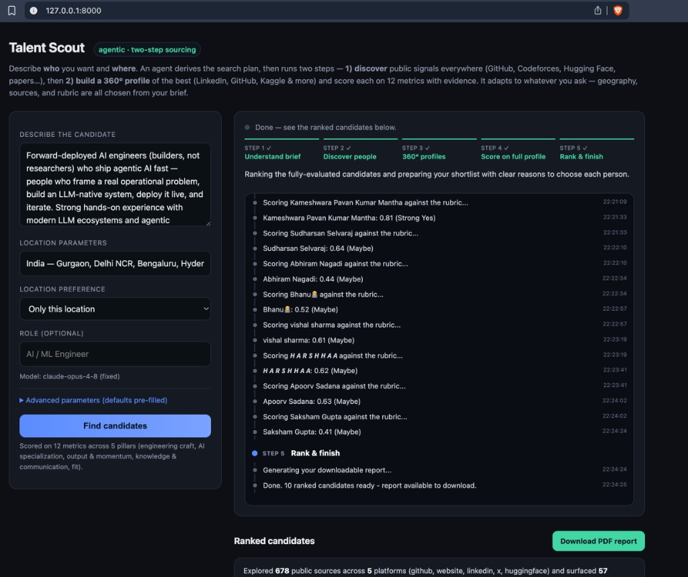

# Talent Scout

An **agentic, two-stage talent-discovery engine**. You describe *who* you want and
*where*; it finds undiscovered builders across the open web, builds a 360° profile of
the best, and scores each against a transparent rubric — driven from a good-looking
localhost UI with live progress.

Built on free public signals (GitHub + OpenRank, Codeforces, Hugging Face, Semantic
Scholar, Stack Overflow) with **Claude as the reasoning brain** for planning,
classification, 360° research, scoring, and outreach.



## The big idea

The best engineers are usually the *least* discovered. The strongest builders are
heads-down shipping — not polishing a LinkedIn headline — so their real signal lives in
places a résumé never captures: merged pull requests into serious repos, models other
people actually download, answers that quietly earn reputation, contest ratings, talks,
papers. Traditional sourcing searches what people *say about themselves*. **Talent Scout
reads what they've actually built** — the way a brilliant technical recruiter would if
they had unlimited time and read every commit — then independently verifies and scores
each person from a full 360° view.

You give it a sentence ("hungry forward-deployed AI engineers in Gurgaon who ship agentic
systems") and it returns a ranked, evidence-backed shortlist of real humans you can hire —
with their work, their links, their contact, and a clear reason for each pick.

## Why it's clever (the interesting bits)

- **It reads work, not words.** On GitHub it weighs merged-PR cadence and code reviews in
  serious projects — the signals that are genuinely hard to fake — not stars or follower
  counts (which are routinely gamed).
- **OpenRank, not vanity metrics.** It uses X-Lab's PageRank-style *OpenRank* influence
  (computed over the real collaboration graph of issues/PRs) to tell genuine impact from
  noise — and to decide which repos are even worth mining in the first place.
- **A bot / influencer filter.** A dedicated layer separates real human builders from
  bots, "AI influencers," recruiters, and company accounts — fusing an LLM read of their
  persona with hard behavioral signals (account age, merged-PR trust loops, real activity).
  In testing it correctly flagged `pytorchmergebot` as a bot and kept it out of the list.
- **"Undiscovered" is a feature, via a hireability lens.** It explicitly *down-ranks*
  already-arrived founders/CTOs and FAANG-anchored profiles, and *up-ranks* hungry,
  early-career, reachable, in-region builders — the people you can actually hire now.
- **Recursive 360° research.** For each finalist it runs a bounded, self-directing
  investigation across LinkedIn, GitHub, Kaggle, Hugging Face, Stack Overflow, X, Reddit,
  blogs, talks and papers — deciding its own follow-up searches ("now find their LinkedIn…
  now confirm the project") — and compiles a single **cited dossier** with every published
  link and a contact.
- **Everything is a 0–1 score with evidence + confidence.** No black-box verdicts: each of
  12 metrics carries a score, a confidence, and a one-line citation of the evidence behind
  it. A human always makes the final call.
- **It plans itself.** Claude turns your free-text brief into the actual search plan —
  geography, languages, repos, keywords, which sources to use, and which metrics to weight.
  Ask for "Rust systems engineers in London" and it retargets the country, languages, and
  even picks the right repos to mine — no code changes.
- **Wide net in, ruthless funnel out.** It casts a deliberately broad discovery net
  (hundreds of candidates), then narrows by *role fit* (below) so the expensive 360° budget
  is spent only on vetted-promising people — and every final score is computed on a
  *complete* profile, never thin data.
- **It ranks by what they actually build.** Before the 360°, it reads each candidate's top
  repositories (names, topics, descriptions) and runs an LLM relevance pass that scores how
  well their real work matches *this* role — so a strong DevOps engineer doesn't crowd out a
  real AI builder for an AI brief.
- **Fast by design.** The heavy stages (360° research, scoring, discovery) run concurrently
  with safe pooled DB access, turning a ~45-min run into ~15.
- **It can get smarter.** As you mark real outcomes (advanced / hired / rejected), it
  re-learns the scoring weights from what actually predicted success.

## What a run feels like

You type a description and a location, hit **Find candidates**, and watch a live, narrated
timeline: *Understand brief → Discover people → 360° profiles → Score on full profile →
Rank.* Each step shows what it's doing in plain English — *"Searching GitHub: Gurgaon /
Python", "+ Apoorv Sadana (@apoorvsadana)", "Building a full 360° picture — candidate 3 of
10", "Verifying this is a real human builder…"*. A few minutes later you get a ranked list
with each person's **key achievements**, **why we chose them**, their cross-platform links
and contact, and a per-metric scorecard — plus a one-click **PDF report** that opens with
an exploration summary (how many sources and platforms were explored to produce it).

## Principles
- **Agentic & adaptive.** Claude reads your brief and derives the search plan —
  geography, sources, languages, repos, keywords, and which metrics matter. Nothing is
  hard-coded; the same engine works for "AI engineers in Bengaluru" or "Rust systems
  engineers in London".
- **Everything is a 0–1 score with evidence.** Humans review a ranked shortlist; the
  model recommends, it never auto-decides.
- **Free-first data.** Official APIs + public data only. Paid enrichment is an optional
  drop-in later.
- **Human-in-the-loop by design** (recruitment AI is high-risk under the EU AI Act; the
  UI is the decision point, not the model).

## The two-step process
1. **Discover (breadth).** From the derived plan, discover candidates from many public
   signals — GitHub (by city/language), Codeforces (country-rated), Hugging Face (model
   authors), and recent papers (Semantic Scholar) — whichever the agent selects for the
   brief. The pool is pre-ranked so only the most promising slice is deeply scored.
2. **360° profile & score (depth).** For the top candidates, investigate everywhere —
   LinkedIn, GitHub, Kaggle, Hugging Face, Stack Overflow, X, Reddit, personal sites,
   talks, papers — with recursive "dig deeper" follow-ups. Collect every public link +
   contact, then score on **12 metrics across 5 pillars** with evidence, confidence, and
   a Strong-Yes/Yes/Maybe/No recommendation.

## Setup

```bash
git clone https://github.com/Prasad-py/AI-Talent-Discovery.git
cd AI-Talent-Discovery
python3 -m venv .venv
./.venv/bin/pip install -r requirements.txt
```

API keys are read from a `.env` in this folder (or its parent):

```
ANTHROPIC_API_KEY=...        # required (the reasoning brain)
GITHUB_TOKEN=...             # strongly recommended: GraphQL + 5000 req/hr (vs 60 unauth)
OPENAI_API_KEY=...           # optional fallback / search grounding
GEMINI_API_KEY=...           # optional fallback / search grounding
```

`.env`, `data/`, `.cache/`, and `reports/` are gitignored.

## Web UI (recommended)

```bash
./.venv/bin/python -m scout.cli serve        # → http://127.0.0.1:8000
```

Enter a plain-language **description** + **location**, choose a **location preference**
("only this location" vs "open to strong candidates elsewhere"), and run. The model is
fixed (Claude); advanced params (candidates to profile & score, research depth, geo
breadth, sources) have sensible defaults. You'll watch it work live — *"Understanding your
brief"*, *"Searching GitHub: Gurgaon / Python"*, *"Building a full 360° picture — candidate
3 of 10"*, *"Verifying this is a real human builder…"* — then get a ranked list with **key
achievements**, **why to choose them**, links + contacts, a per-metric scorecard, and a
**Download PDF report** button.

By default the agent **chooses the sources** for your brief; you can force-include specific
sources or pin parameters in the Advanced panel.

## CLI (headless / power use)

```bash
python -m scout.cli check                       # validate config + API keys
python -m scout.cli init-db                      # create tables

python -m scout.cli deep-run --top 10            # full two-stage run + PDF report
python -m scout.cli deep-run --top 10 --no-geo-strict   # allow strong candidates elsewhere
python -m scout.cli list                         # show the ranked shortlist
python -m scout.cli report --top 25              # (re)generate the PDF report

# individual stages
python -m scout.cli discover-geo                 # GitHub user-search by city/language
python -m scout.cli codeforces-india             # country-rated competitive programmers
python -m scout.cli discover --limit-repos 3     # mine contributors of high-OpenRank repos
python -m scout.cli score                        # 12-metric scorecard on the pool
python -m scout.cli deep-dive --top 10           # 360° deep view on the top candidates
python -m scout.cli outreach --top 10            # personalized outreach drafts

# Stage 7 (optional): AI interview + feedback loop
python -m scout.cli interview-questions --candidate 1
python -m scout.cli interview-score --candidate 1 --transcript ./transcript.txt
python -m scout.cli outcome --candidate 1 --label hired     # advanced|hired|rejected
python -m scout.cli retrain                                 # relearn scorecard weights from outcomes
```

## Scoring rubric (12 metrics · 5 pillars)
Modeled on how talent-intelligence platforms (SeekOut, Eightfold) score — weighted,
evidence-backed factors with a recommendation:

- **Technical Craft** — engineering depth, code-quality judgment, open-source impact
- **AI Specialization** — AI/ML domain depth, ahead-of-curve adoption
- **Output & Momentum** — shipping velocity, consistency/momentum
- **Knowledge & Communication** — research depth, communication/writing, community standing
- **Fit** — authenticity (real builder vs bot/influencer), hireability (hungry, reachable,
  in-geo; arrived founders/CTOs/FAANG score low)

Each metric carries a 0–1 score, a confidence, and a one-line evidence citation. As you
record real outcomes, `retrain` relearns the weights from what actually predicted success
(written to `config/learned_weights.json`, preferred by the scorer when present).

## Configuration
Edit `config/icp.yaml` for defaults: target geography/areas, GitHub languages + target
repos, Codeforces thresholds, rubric weights, and `seeds` (known-good / known-bad GitHub
logins that calibrate cold-start scoring). The UI's brief overrides these per run.

## Layout
- `scout/intake.py` — brief → structured search plan (the agentic planner)
- `scout/sources/` — `github`, `openrank`, `codeforces`, `huggingface`, `scholar`,
  `stackexchange`, `discover` (GitHub repo + India/geo discovery)
- `scout/authenticity/` — real-builder vs bot/influencer/recruiter classifier
- `scout/enrich/profile360.py` — multi-source 360° research → cited dossier
- `scout/resolve/` — cross-platform identity resolution
- `scout/contact/` — free contact discovery
- `scout/scoring/scorecard.py` — 12-metric rubric + composite
- `scout/outreach/` — personalized message drafting
- `scout/interview/` + `scout/feedback/` — AI interview + outcome-driven weight learning
- `scout/report.py` — professional PDF report (with exploration summary)
- `scout/webjob.py` + `webapp/` — web UI server, job runner, live progress (SSE)
- `scout/pipeline.py` — headless two-stage orchestrator · `scout/cli.py` — command line

## Security & compliance
Public data via official APIs only; respects rate limits. Keep `.env` private (gitignored)
and rotate any key that was shared. Recruitment AI carries obligations (EU AI Act high-risk,
India DPDP) — the human-in-the-loop design and evidence-linked, explainable scores are there
to keep it defensible.
